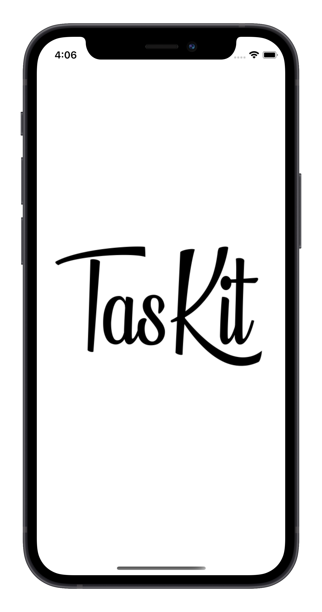
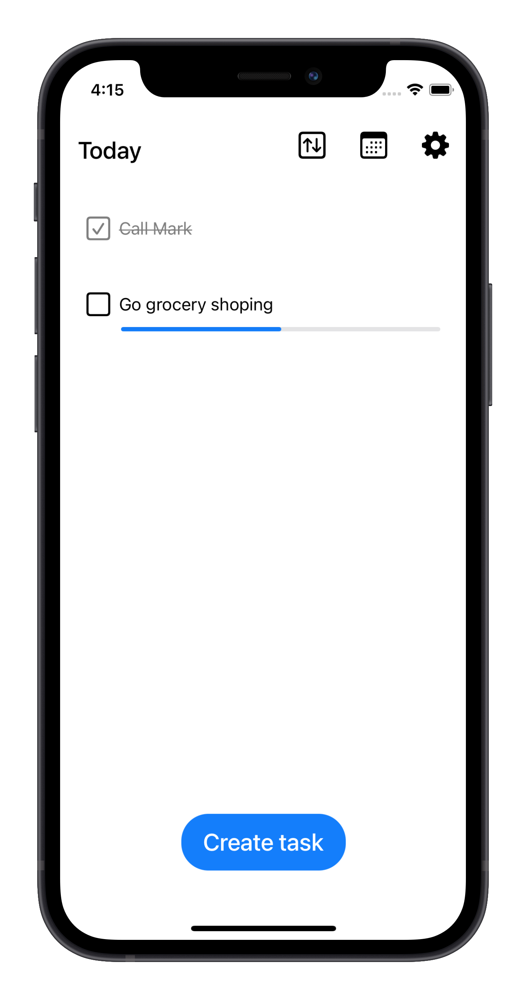
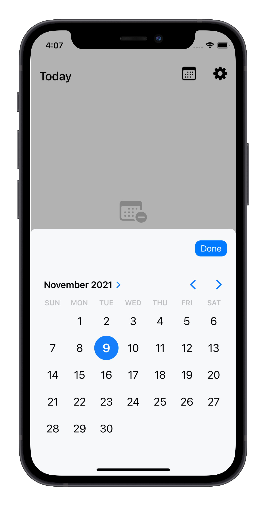
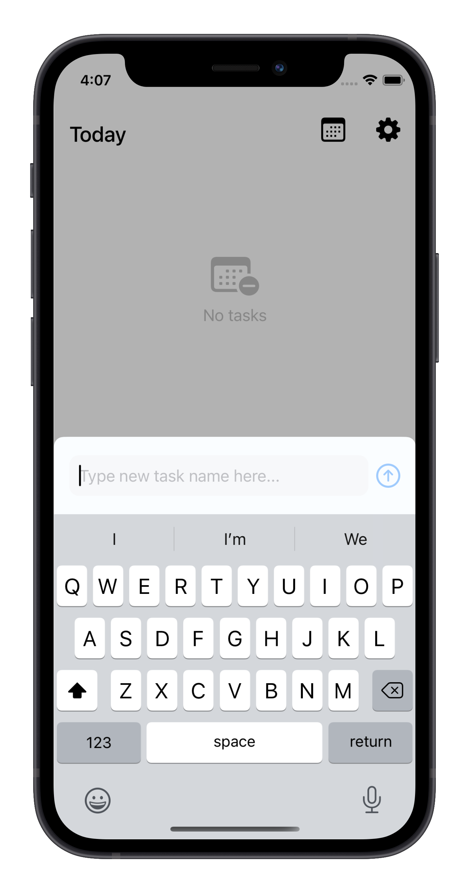
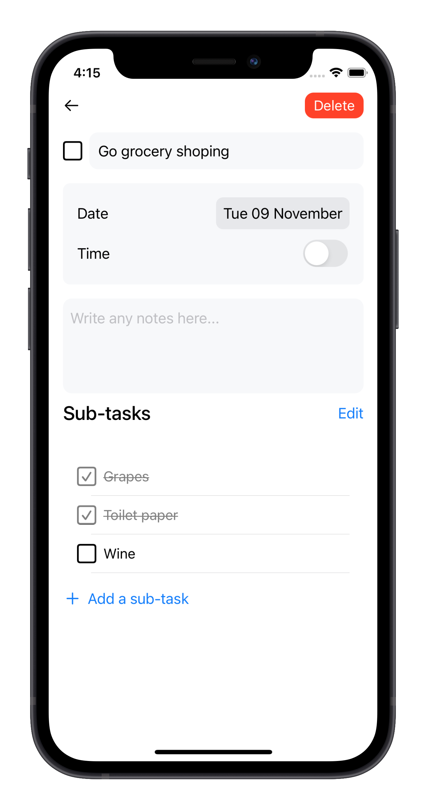

# TasKit

   

    iOS task manager that is backed by CloudKit  and automatically syncs changes across devices. Architecture is done using MVVM pattern and also mocking VMs so we can create "fakes" that can be used when using SwiftUI previews.
  

  

	  
	  
	  
	  
	  
  

## Requirements

- iOS 14.0+
- Xcode 12.0+

## Contribute

If you have feature requests or bug reports, feel free to help out by sending pull requests or by [creating new issues](https://github.com/kyledold/taskit/issues/new). 

Please take a moment to
review the [CONTRIBUTING](.github/CONTRIBUTING.md) guidelines.

## Frameworks

- CloudKit
- CoreData
- SwiftUI
- Combine
- Introspect

## License

"TasKit" is released under the MIT license. See [LICENSE](mit) for details.

[https://github.com/kyledold](/)

[swift-image]:https://img.shields.io/badge/swift-5.0-orange.svg
[swift-url]: https://swift.org/
[license-image]: https://img.shields.io/badge/License-MIT-blue.svg
[license-url]: LICENSE
